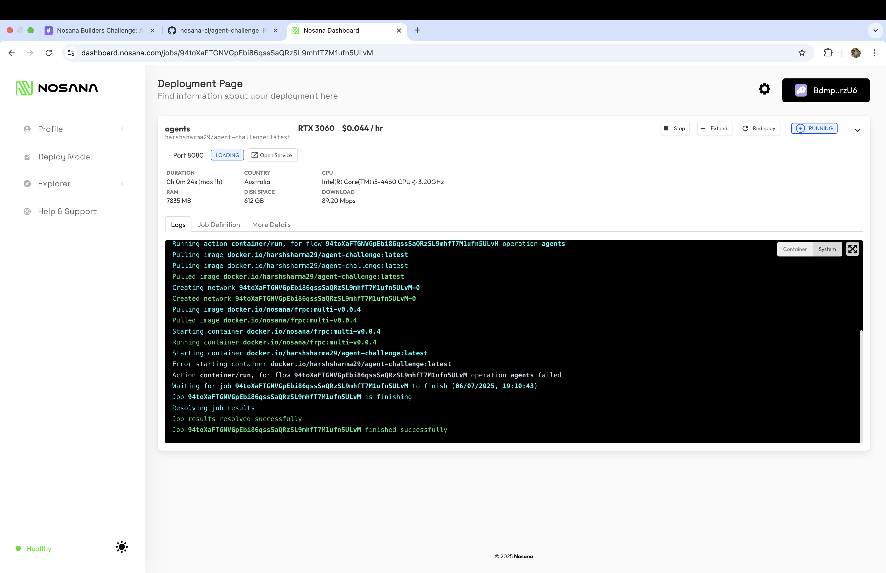

# Agent Challenge: DeepWatch

DeepWatch is an AI-powered smart contract auditing agent designed to analyze EVM smart contracts for suspicious patterns, security risks, and vulnerabilities. Built with the Mastra framework, DeepWatch combines heuristic detection and AI-enhanced analysis to provide comprehensive security reports, risk scores, and actionable recommendations. The agent is suitable for developers, auditors, and security researchers seeking automated, multi-chain contract analysis.

## Features

- **Heuristic and AI-powered contract analysis**
- **AI-generated summary** in every report
- **Risk scoring and findings** for each contract
- **Wallet risk scoring** for top interacting wallets
- **Discord webhook alerts** for high/critical risk contracts
- **Multi-chain support** (Ethereum, Polygon, BSC, Arbitrum)
- **Improved timeouts and error handling** for reliability
- **Testable via Mastra UI or custom Next.js frontend**

## Setup Instructions

1. **Clone the repository:**
   ```sh
   git clone https://github.com/harshdev2909/agent-challenge.git
   cd agent-challenge
   ```
2. **Install dependencies:**
   ```sh
   npm install
   # or
   pnpm install
   ```
3. **Set up your environment variables:**
   - Copy `.env.example` to `.env` and fill in the required API keys (see below).
4. **Start the Mastra backend:**
   ```sh
   npm start
   # or
   pnpm start
   ```
5. **(Optional) Start the frontend:**
   ```sh
   cd frontend
   npm install
   npm run dev
   ```

## Environment Variables Required

Add the following to your `.env` file in the project root:

```env
# Required for blockchain data
ETHERSCAN_API_KEY=your_etherscan_api_key
POLYGONSCAN_API_KEY=your_polygonscan_api_key
BSCSCAN_API_KEY=your_bscscan_api_key
ARBISCAN_API_KEY=your_arbiscan_api_key

# Optional for AI-enhanced analysis
OPENAI_API_KEY=your_openai_api_key
OPENAI_MODEL=gpt-4
CLAUDE_API_KEY=your_claude_api_key
CLAUDE_MODEL=claude-3-sonnet-20240229
```

See the agent README for more details on obtaining these keys.

## Docker Build and Run

To build and run the agent using Docker:

```sh
docker build -t harshsharma29/agent-challenge:latest .
docker run --rm -p 8080:8080 --env-file .env harshsharma29/agent-challenge:latest
```

---

## Nosana Deployment Proof

Below is a screenshot of the successful deployment of the DeepWatch agent on the Nosana network. This demonstrates that the Docker container was correctly built, pushed, and executed in the Nosana environment.



- **Job Definition:**
  - Image: `docker.io/harshsharma29/agent-challenge:latest`
  - GPU: RTX 3060
  - Port exposed: 8080
  - Entrypoint: `/bin/sh`
  - RAM: 64GB, Disk: 1TB, CPU: Xeon E5-2680 v4

---

## Usage

### 1. Mastra UI (localhost:8080)
- Start the Mastra backend and visit [http://localhost:8080](http://localhost:8080)
- Use the DeepWatch agent's `analyze-contract` tool to analyze any EVM contract
- Output includes risk level, findings, recommendations, and an AI summary

### 2. Custom Next.js Frontend
- Start the frontend in `/frontend` for a modern, user-friendly interface
- Enter a contract address and chain, view results as cards, tables, and Markdown-rendered AI summary

### 3. Example Output

```
{
  "contractAddress": "0x...",
  "riskLevel": "Medium",
  "riskScore": 30,
  "findings": [...],
  "summary": "HIGH RISK: ...",
  "recommendations": [...],
  "aiSummary": "This contract is medium risk. 1 high severity issue detected...",
  "contractType": "ERC20"
}
```

## Troubleshooting

- **504 Gateway Timeout**: The backend and server timeouts have been increased (20s fetch, 30s server). If you still see timeouts, check your network/API keys.
- **AI summary missing**: Ensure your AI provider API key is set and valid.
- **API errors**: Double-check all required API keys in your `.env` file.

## Customization

- To improve the Mastra UI output, ensure your tool returns clear, structured fields (see agent README).
- For a fully custom experience, use or extend the Next.js frontend.

## License

This project is part of the Mastra framework and follows the same licensing terms.
